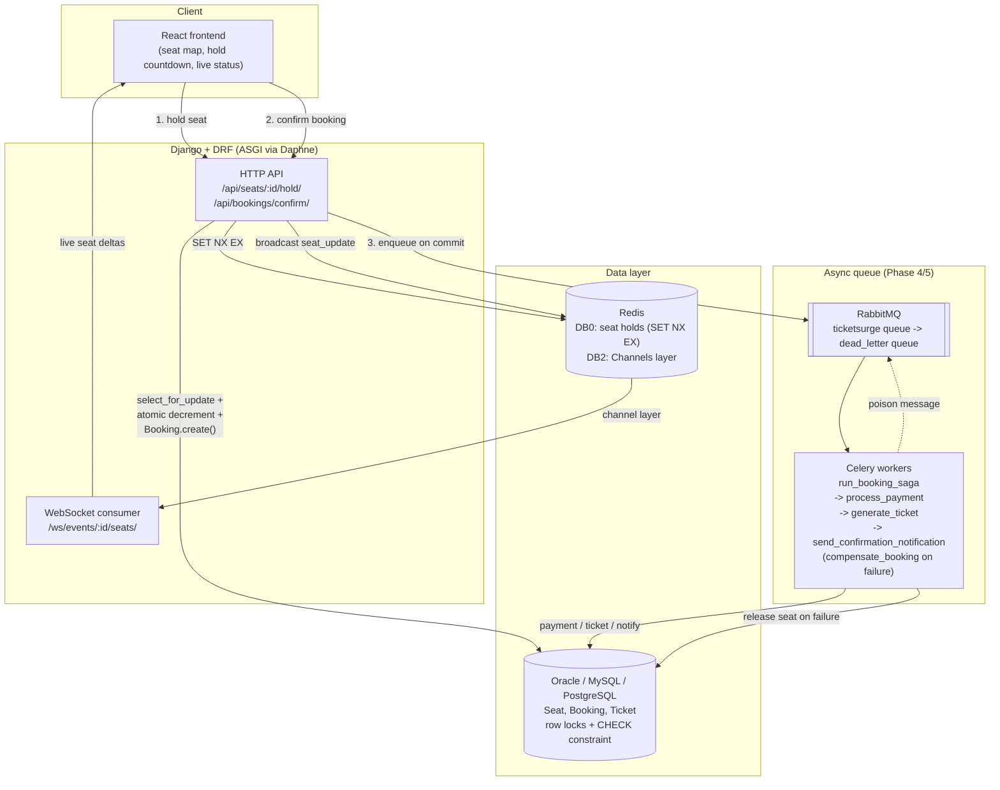

# TicketSurge — system architecture

## Request-path vs. async-path summary

| Step | Where | Store touched | Latency budget |
|---|---|---|---|
| Hold a seat | HTTP, synchronous | Redis only | milliseconds |
| Confirm (decrement + create Booking) | HTTP, synchronous, one DB transaction | Primary DB | milliseconds |
| Payment / ticket / notification | Celery worker, asynchronous | Primary DB | seconds (off the request path) |
| Seat-map push | Django Channels, asynchronous | Redis channel layer | near-real-time |

The two synchronous DB writes above are deliberately the *only* two
things standing between "many users click buy at once" and "exactly one
booking exists per seat" — see `core/booking.py` and
`docs/adr/0003-database-strategy.md` for why that's sufficient without a
distributed lock service.
